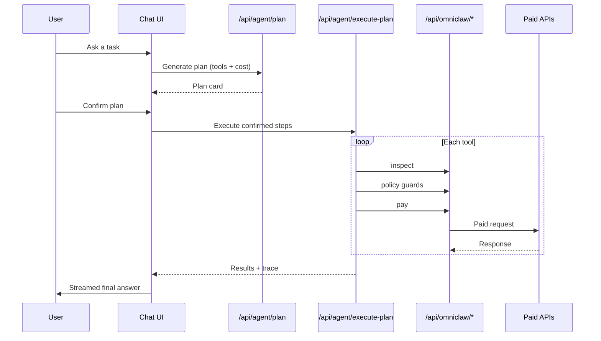

# OmniClaw Console

A Next.js workspace for **agent-driven, pay-per-call API workflows** on Arc. Plan paid API requests in chat, review cost and tools before spending, execute x402-style payments through OmniClaw, and monitor wallet balances, policy guards, and on-chain activity in one dark console UI.


Built for the **[Agentic Economy on Arc](https://lablab.ai/ai-hackathons/nano-payments-arc)** hackathon by [lablab.ai](https://lablab.ai) and Circle — demonstrating how Circle Nanopayments and Arc make sub-cent, high-frequency USDC transactions economically viable for APIs and AI agents.

## Hackathon context

| | |
| --- | --- |
| **Event** | [Agentic Economy on Arc](https://lablab.ai/ai-hackathons/nano-payments-arc) (lablab.ai × Circle) |
| **Challenge** | Build the agentic economy on Arc using programmable USDC and Nanopayments |
| **Settlement** | Arc testnet — USDC as native gas and stablecoin |
| **Payments** | Circle Gateway Nanopayments + x402 inspect/pay |
| **Data APIs** | [AIsa](https://aisa.one) pay-per-call skills (Twitter, crypto, search, and more) |

### Track alignment

This project maps to several hackathon tracks:

| Track | How OmniClaw Console addresses it |
| --- | --- |
| **Per-API monetization** | Each allowlisted tool charges per request in USDC (e.g. $0.00044/call) via x402. |
| **Consumer AI payments** | An AI assistant plans and executes payments on the user's behalf, with explicit plan review and confirmation before any spend. |
| **Usage-based billing** | Pricing aligns to actual API usage — per query, per endpoint — with real-time settlement through OmniClaw. |
| **Agent-to-agent commerce** | Autonomous planner agents select and pay for data services without batching or subscription lock-in. |

### Economic proof

The hackathon requires more than a demo — submissions must show viable micropayment economics. This console surfaces that directly:

- **Sub-cent pricing** — catalog tools price at ≤ $0.01 per action (most calls are fractions of a cent).
- **High-frequency settlement** — each confirmed plan can trigger many on-chain inspect/pay transactions in a single session.
- **Margin explanation** — the unit economics panel compares Base/Solana gas costs against gateway micropayment costs, showing why traditional per-tx gas would break this model.

Circle describes the core idea: *the internet made information programmable; Circle Nanopayments + Arc make value programmable — and economically viable at high frequency.*

## What it does

| You get | How |
| --- | --- |
| **Chat-first planning** | Natural-language prompts map to allowlisted paid API tools with estimated USDC cost. |
| **Explicit confirmation** | No payment runs until you approve the generated plan. |
| **x402 inspect → pay** | Each call is inspected, policy-checked, and paid through OmniClaw server routes. |
| **Live execution trace** | Inspect, guard, and payment steps replay in the UI as they happen. |
| **Wallet + activity** | EOA, Circle, and Gateway balances; deposits, withdrawals, and ArcScan links. |
| **Unit economics** | Base and Solana gas estimates compared against gateway micropayment costs. |

## Quick start

**Prerequisites:** [Node.js](https://nodejs.org/) 20+, [pnpm](https://pnpm.io/), a running OmniClaw backend/API stack, and at least one AI provider API key (or rely on the built-in fallback planner for supported prompts).

```powershell
pnpm install
# Create .env.local — see Environment section below
pnpm dev
```

Open [http://localhost:3000](http://localhost:3000).

Production checks:

```powershell
pnpm typecheck
pnpm lint
pnpm build
```

## Example prompts

Try these once OmniClaw and your AI provider are configured:

- *Get the latest tweets from @elonmusk.*
- *What is the current price of ETH?*
- *Search YouTube for "Arc blockchain tutorial".*
- *What are the top trending topics on Twitter right now?*
- *Show me Polymarket odds for the next US election.*

Prompt suggestions also appear in the service catalog sidebar.

## Product flow



1. User sends a task in the chat composer.
2. A short acknowledgement posts while planning starts.
3. The planner maps the request to allowlisted paid API tools.
4. The plan card shows selected tools, estimated cost, and reasons.
5. The user confirms — **no payment executes before this step**.
6. The execution route inspects each endpoint, runs policy checks, pays through OmniClaw, and captures responses.
7. The execution trace replays inspect, guard, and payment steps in real time.
8. A final answer is streamed from the executed API responses.
9. Wallet balances and activity panels refresh from the header.

## Console layout

```text
┌─────────────────────────────────────────────────────────────────┐
│  Header — model selector, wallet balances, deposit/withdraw     │
├──────────────┬──────────────────────────────┬───────────────────┤
│ Left sidebar │         Chat window          │  Right sidebar    │
│              │  thread · plan card · trace  │  service catalog  │
│ Active guards│                              │  + prompt ideas   │
│ Unit econ.   │                              │                   │
│ Transactions │                              │                   │
└──────────────┴──────────────────────────────┴───────────────────┘
```

## Integrated skills

Six seller skill categories drive the service catalog and planner metadata. **22 allowlisted tools** are active in the execution catalog (`lib/agent/api-catalog.ts`).

| Skill | Domain |
| --- | --- |
| Twitter Autopilot | Profiles, tweets, trends, communities |
| Multi-Source Search | Web and news search |
| YouTube SERP | Video search and metadata |
| Crypto Market Data | Prices, tickers, market snapshots |
| MarketPulse | Financial statements and market data |
| Prediction Market Data | Polymarket and prediction-market odds |

Full endpoint metadata lives in `agent-skills/*/data.json`. Visible categories and prompt suggestions are loaded via `lib/services/skill-catalog.ts`.

## Tech stack

| Layer | Choices |
| --- | --- |
| Framework | Next.js 16 (App Router, Turbopack dev) |
| UI | React 19, Tailwind CSS 4, Base UI, shadcn-style primitives |
| State | Zustand (`lib/stores/omniclaw-store.ts`) |
| AI routing | Gemini, Featherless, AIVML with fallback keyword matching |
| Payments | OmniClaw proxy + Circle Gateway Nanopayments (x402 inspect/pay) |
| Chain | Arc testnet — USDC settlement, Circle Wallets, ArcScan explorer |
| Data | AIsa pay-per-call API skills via `agent-skills/` metadata |

## Architecture

```text
Next.js app
  app/page.tsx
    -> components/omniclaw-console.tsx
    -> components/layout/console-shell.tsx

UI surfaces
  components/chat          Chat, plan confirmation, execution trace
  components/activity      Payments, deposits, withdrawals
  components/guards        Active wallet/policy guard display
  components/services      Service catalog and system status
  components/wallet        EOA, Circle, and Gateway balance controls
  components/economics     Per-call unit economics

Agent layer
  lib/agent/api-catalog.ts       Paid API tool catalog (allowlist)
  lib/agent/ai-planner.ts        Provider + fallback planning logic
  lib/agent/model-registry.ts    Provider/model availability
  lib/agent/providers/*          Gemini, Featherless, AIVML adapters
  app/api/agent/*                Planner, execution, model, and answer routes

OmniClaw layer
  lib/omniclaw/client.ts         OmniClaw API client
  lib/omniclaw/services.ts         Paid endpoint templates
  app/api/omniclaw/*             Next.js proxy routes
  lib/stores/omniclaw-store.ts   Client-side wallet/activity/execution state
```

## Project structure

```text
app/
  api/
    agent/
      models/              GET available provider models
      preamble/            POST short acknowledgement
      plan/                POST execution plan
      execute-plan/        POST confirmed plan execution
      final-answer-stream/ POST final answer stream
    economics/
      base-gas/            GET live Base gas estimate
      solana-gas/          GET Solana reference fee estimate
    omniclaw/
      health/              GET OmniClaw health
      address/             GET wallet addresses
      balance-detail/      GET detailed wallet/gateway balances
      wallets/             GET wallet list
      deposit/             POST gateway deposit
      withdraw/            POST gateway withdrawal
      inspect/             POST payable endpoint inspect
      pay/                 POST paid endpoint execution
      transactions/        GET recent transaction activity
      explorer/            GET ArcScan-derived snapshot
agent-skills/              Per-skill metadata and prompt suggestions
components/
  activity/                Gateway activity panels
  chat/                    Chat window, composer, plan card, trace
  economics/               Unit economics block
  guards/                  Active guard panel
  layout/                  Console shell, sidebars, header
  services/                Service catalog and system status
  ui/                      Local UI primitives
  wallet/                  Balance badges and gateway transfer control
lib/
  agent/                   Planner, provider adapters, catalog, formatting
  explorer/                ArcScan helpers
  omniclaw/                OmniClaw client/service helpers
  services/                Skill catalog metadata
  storage/                 Chat localStorage helpers
  stores/                  Zustand app state
docs/
  design-decisions.md      Architecture decisions and change log
```

## Environment

Create `.env.local` in the project root:

```env
# OmniClaw backend/proxy targets
OMNICLAW_BACKEND_URL=http://localhost:8090
OMNICLAW_API_URL=http://localhost:8080

# Token accepted by the OmniClaw API service
# OMNICLAW_AGENT_TOKEN is also supported
OMNICLAW_API_TOKEN=your_omniclaw_token

# Optional ArcScan endpoint override
ARCSCAN_API_URL=https://testnet.arcscan.app/api

# AI providers — configure at least one for provider-backed planning
GEMINI_API_KEY=your_gemini_key
GEMINI_MODEL=gemini-2.5-flash,gemini-2.0-flash

FEATHERLESS_API_KEY=your_featherless_key
FEATHERLESS_MODEL=qwen3.5-plus,claude-haiku-4-5,nemotron-super-free
FEATHERLESS_BASE_URL=https://api.featherless.ai/v1

AIVML_API_KEY=your_aivml_key
AIVML_MODEL=gpt-4o-mini,mistral-small
AIVML_BASE_URL=https://api.aimlapi.com/v1
```

| Variable | Required | Purpose |
| --- | --- | --- |
| `OMNICLAW_API_URL` | Yes | OmniClaw API service (inspect/pay) |
| `OMNICLAW_API_TOKEN` or `OMNICLAW_AGENT_TOKEN` | Yes | Auth for OmniClaw API |
| `OMNICLAW_BACKEND_URL` | Yes | Wallet/balance/activity proxy backend |
| `GEMINI_API_KEY` / `FEATHERLESS_API_KEY` / `AIVML_API_KEY` | One of | AI-backed plan generation |
| `ARCSCAN_API_URL` | No | ArcScan API override |

The fallback planner handles supported prompt patterns when no AI provider is configured.

## Scripts

| Command | Purpose |
| --- | --- |
| `pnpm dev` | Start the Next.js dev server with Turbopack |
| `pnpm build` | Build the production app |
| `pnpm start` | Start the production server after a build |
| `pnpm lint` | Run ESLint |
| `pnpm typecheck` | Run TypeScript without emitting files |
| `pnpm format` | Format TypeScript and TSX files with Prettier |

## API catalog

Paid tools are defined in `lib/agent/api-catalog.ts`. Each entry includes:

- Tool id, display name, and skill category
- Endpoint path and HTTP method
- Price in USDC
- Parameter schema (for planner input population)
- Aliases for fallback keyword matching
- `allowlisted` flag — only `true` tools can execute

To add a new tool: register the endpoint in `lib/omniclaw/services.ts`, add a catalog entry with `allowlisted: true`, and optionally extend `agent-skills/<skill>/data.json` for UI metadata.

## Payment and execution

- **Planning is separate from execution** — `/api/agent/plan` never charges.
- **User confirmation is mandatory** — the UI only calls `/api/agent/execute-plan` after approval.
- **Allowlist enforcement** — execution rejects tools not marked `allowlisted: true`.
- **Inspect then pay** — routes through `/api/omniclaw/inspect` and `/api/omniclaw/pay`.
- **Transparent UI** — payment and activity details surface in the console; the streamed answer focuses on API results.

## Troubleshooting

### Dev server lock

```powershell
Remove-Item -Recurse -Force .next\dev\lock
pnpm dev
```

### Port 3000 in use

```powershell
netstat -ano | findstr :3000
taskkill /PID <pid> /F
```

### OmniClaw auth errors

Verify one of these is set and matches your running OmniClaw service:

```env
OMNICLAW_API_TOKEN=...
OMNICLAW_AGENT_TOKEN=...
```

Confirm `OMNICLAW_API_URL` points to the OmniClaw API (default `http://localhost:8080`).

### Backend proxy unavailable

Wallet and activity routes proxy to `OMNICLAW_BACKEND_URL` (default `http://localhost:8090`). Start that backend or update the variable.

### Empty model selector

Set at least one provider key (`GEMINI_API_KEY`, `FEATHERLESS_API_KEY`, or `AIVML_API_KEY`) and restart `pnpm dev`.

## Documentation

- [`docs/design-decisions.md`](docs/design-decisions.md) — architecture decisions and change log

### Hackathon and partner resources

- [Agentic Economy on Arc — lablab.ai](https://lablab.ai/ai-hackathons/nano-payments-arc)
- [Arc documentation](https://docs.arc.network/)
- [Circle Nanopayments documentation](https://developers.circle.com/)
- [AIsa API skills](https://aisa.one)

## License

Built for the [Agentic Economy on Arc](https://lablab.ai/ai-hackathons/nano-payments-arc) hackathon.
